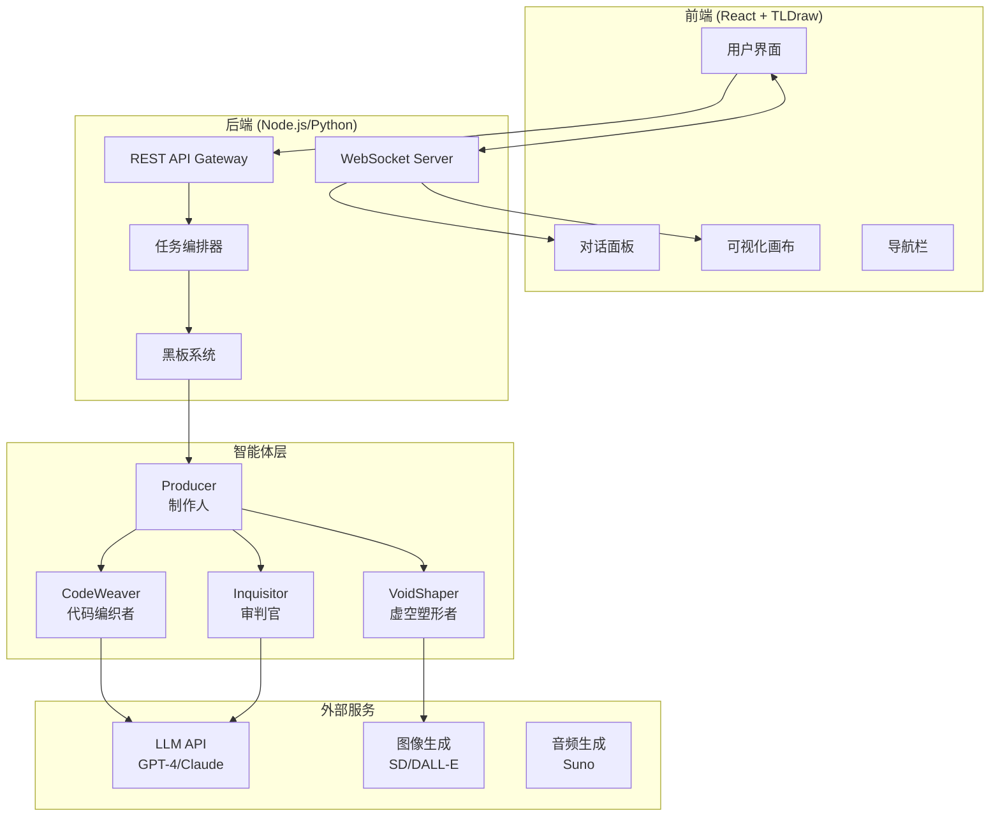
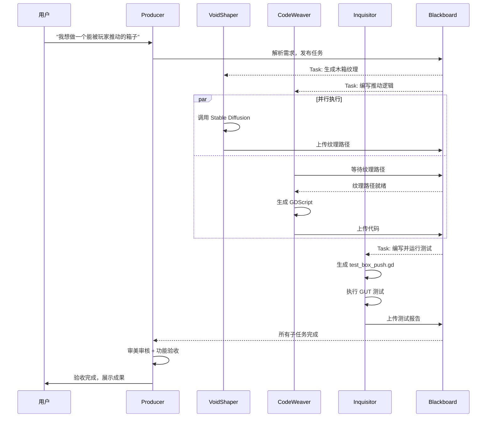
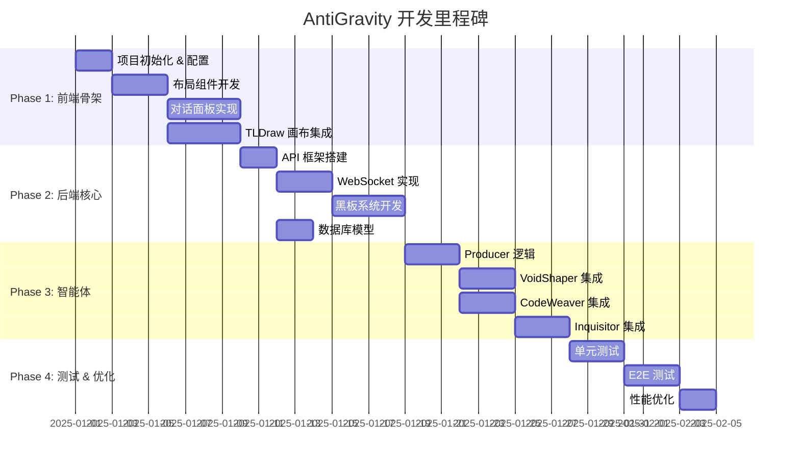

# AntiGravity 多智能体协作平台 - 软件设计文档 (SDD)

> **版本**: 1.0  
> **日期**: 2025-12-29  
> **项目代号**: OiiLike (AntiGravity Agent Workspace)

---

## 1. 项目概述

### 1.1 目标
复刻 [OiiOii.ai Space](https://www.oiioii.ai/space/3461b584-51e9-432f-b51c-c2a5c674714c) 的前端交互体验，替换为 **AntiGravity** 四智能体系统（Producer、VoidShaper、CodeWeaver、Inquisitor），并构建数据驱动的后端架构。

### 1.2 核心功能
| 功能模块 | 描述 |
|---------|------|
| 多智能体对话 | 用户输入自然语言，由 Producer 分解任务并分发给其他智能体 |
| 可视化画布 | 展示智能体产出的资产（代码、图像、测试报告）及协作流程 |
| 黑板系统 | 智能体间共享状态的实时数据总线 |
| 任务追踪 | 展示每个子任务的执行状态与验收结果 |

---

## 2. 系统架构

### 2.1 整体架构图



### 2.2 技术选型

| 层级 | 技术栈 | 理由 |
|------|--------|------|
| **前端框架** | Next.js 14 (App Router) | SSR支持、优秀的开发体验 |
| **UI组件** | Radix UI + 自定义样式 | 无障碍、可定制 |
| **画布引擎** | TLDraw | 开源、支持协作、易扩展 |
| **状态管理** | Zustand | 轻量、支持中间件 |
| **后端框架** | FastAPI (Python) | 异步支持好、适合AI工作流 |
| **实时通信** | WebSocket (Socket.IO) | 双向实时推送 |
| **数据库** | PostgreSQL + Redis | 持久化 + 缓存/消息队列 |
| **消息队列** | Redis Pub/Sub | 智能体间通信 |

---

## 3. 前端设计

### 3.1 页面布局结构

```
┌─────────────────────────────────────────────────────────────────┐
│  Logo   │          项目标题          │  积分  │  分享  │  用户  │
├────┬────┴───────────────────────────┴────────┴────────┴────────┤
│    │                                                            │
│ 导 │     对话/工作流面板 (~35%)      │    可视化画布 (~60%)     │
│ 航 │  ┌─────────────────────────┐   │  ┌────────────────────┐  │
│ 栏 │  │ [Producer] 任务分解中...│   │  │   ┌──────┐         │  │
│    │  │ ✓ 已获取知识库          │   │  │   │ 资产 │─────┐   │  │
│ 60 │  │ ✓ 已分配给 VoidShaper   │   │  │   │ 节点 │     │   │  │
│ px │  │                         │   │  │   └──────┘     ▼   │  │
│    │  │ [VoidShaper] 生成纹理..│   │  │          ┌──────┐   │  │
│    │  │ 🎨 Stable Diffusion     │   │  │          │ 代码 │   │  │
│    │  │                         │   │  │          │ 节点 │   │  │
│    │  │ [CodeWeaver] 编写逻辑..│   │  │          └──────┘   │  │
│    │  └─────────────────────────┘   │  └────────────────────┘  │
│    │  ┌─────────────────────────┐   │  ┌────────────────────┐  │
│    │  │ 🅰️ 输入消息...          │   │  │  ➕  ➖  🖐️  🔲  │  │
│    │  │ [+] [风格] [角色] [发送]│   │  └────────────────────┘  │
│    │  └─────────────────────────┘   │                          │
└────┴────────────────────────────────┴──────────────────────────┘
```

### 3.2 组件层级

```
src/
├── app/
│   ├── layout.tsx              # 全局布局
│   ├── page.tsx                # 首页
│   └── space/
│       └── [id]/
│           └── page.tsx        # 工作空间页面
├── components/
│   ├── layout/
│   │   ├── Navbar.tsx          # 左侧导航栏
│   │   ├── Header.tsx          # 顶部标题栏
│   │   └── ResizablePanel.tsx  # 可调整宽度的面板
│   ├── chat/
│   │   ├── ChatPanel.tsx       # 对话面板容器
│   │   ├── MessageBubble.tsx   # 消息气泡
│   │   ├── AgentHeader.tsx     # 智能体头部(头像+名称)
│   │   ├── StatusCard.tsx      # 任务状态卡片
│   │   ├── ThinkingProcess.tsx # 思考过程折叠区
│   │   └── MessageInput.tsx    # 消息输入框
│   ├── canvas/
│   │   ├── WorkspaceCanvas.tsx # TLDraw画布封装
│   │   ├── AssetNode.tsx       # 资产节点(图像/视频)
│   │   ├── CodeNode.tsx        # 代码节点
│   │   ├── TestNode.tsx        # 测试报告节点
│   │   └── ConnectionLine.tsx  # 节点连接线
│   └── agents/
│       ├── AgentAvatar.tsx     # 智能体头像组件
│       └── AgentConfig.ts      # 智能体配置(颜色/图标)
├── hooks/
│   ├── useWebSocket.ts         # WebSocket连接
│   ├── useBlackboard.ts        # 黑板状态订阅
│   └── useAgentStream.ts       # 智能体流式输出
├── stores/
│   ├── chatStore.ts            # 对话状态
│   ├── canvasStore.ts          # 画布状态
│   └── agentStore.ts           # 智能体状态
└── styles/
    ├── globals.css             # 全局样式
    ├── theme.css               # 主题变量
    └── components/             # 组件样式
```

### 3.3 设计规范

#### 3.3.1 色彩系统

```css
:root {
  /* 背景色 */
  --bg-primary: #0D0D0D;
  --bg-secondary: #121212;
  --bg-panel: #1A1A1A;
  --bg-card: rgba(26, 26, 26, 0.8);
  
  /* 强调色 - 智能体专属 */
  --color-producer: #FF3399;      /* 霓虹粉 - Producer */
  --color-voidshaper: #8B5CF6;    /* 紫罗兰 - VoidShaper */
  --color-codeweaver: #10B981;    /* 翠绿 - CodeWeaver */
  --color-inquisitor: #F59E0B;    /* 琥珀 - Inquisitor */
  
  /* 状态色 */
  --status-success: #4ADE80;
  --status-pending: #FACC15;
  --status-error: #EF4444;
  
  /* 文字色 */
  --text-primary: #FFFFFF;
  --text-secondary: rgba(255, 255, 255, 0.7);
  --text-muted: rgba(255, 255, 255, 0.5);
  
  /* 边框与阴影 */
  --border-subtle: rgba(255, 255, 255, 0.1);
  --glow-pink: 0 0 20px rgba(255, 51, 153, 0.4);
}
```

#### 3.3.2 智能体视觉标识

| 智能体 | 图标 | 主色 | 性格关键词 |
|--------|------|------|-----------|
| **Producer** | 🎬 导演板 | `#FF3399` | 沉稳、统筹、把关 |
| **VoidShaper** | 🎨 调色板 | `#8B5CF6` | 感性、创造力、艺术 |
| **CodeWeaver** | ⚙️ 齿轮 | `#10B981` | 严谨、逻辑、规范 |
| **Inquisitor** | 🔍 放大镜 | `#F59E0B` | 审慎、洞察、纠错 |

---

## 4. 后端设计

### 4.1 API 设计

#### 4.1.1 RESTful 端点

```yaml
# 工作空间管理
POST   /api/spaces              # 创建工作空间
GET    /api/spaces/:id          # 获取工作空间详情
DELETE /api/spaces/:id          # 删除工作空间

# 消息与任务
POST   /api/spaces/:id/messages # 发送用户消息
GET    /api/spaces/:id/messages # 获取历史消息
GET    /api/spaces/:id/tasks    # 获取任务列表

# 资产管理
GET    /api/spaces/:id/assets   # 获取资产列表
GET    /api/assets/:id/download # 下载资产
```

#### 4.1.2 WebSocket 事件

```typescript
// 客户端 -> 服务端
interface ClientEvents {
  'user:message': { content: string; spaceId: string };
  'canvas:update': { nodeId: string; position: Position };
}

// 服务端 -> 客户端
interface ServerEvents {
  'agent:thinking': { agent: AgentType; content: string };
  'agent:message': { agent: AgentType; content: string; status: 'streaming' | 'complete' };
  'task:update': { taskId: string; status: TaskStatus; progress: number };
  'asset:created': { assetId: string; type: 'image' | 'code' | 'audio'; url: string };
  'blackboard:update': { key: string; value: any };
}
```

### 4.2 数据模型

```typescript
// 工作空间
interface Space {
  id: string;
  title: string;
  userId: string;
  createdAt: Date;
  updatedAt: Date;
}

// 消息
interface Message {
  id: string;
  spaceId: string;
  role: 'user' | 'producer' | 'voidshaper' | 'codeweaver' | 'inquisitor';
  content: string;
  metadata?: {
    thinkingProcess?: string;
    statusCards?: StatusCard[];
  };
  createdAt: Date;
}

// 任务
interface Task {
  id: string;
  spaceId: string;
  parentTaskId?: string;
  assignedAgent: AgentType;
  type: 'generate_image' | 'write_code' | 'run_test' | 'review';
  status: 'pending' | 'running' | 'completed' | 'failed';
  input: Record<string, any>;
  output?: Record<string, any>;
  createdAt: Date;
  completedAt?: Date;
}

// 资产
interface Asset {
  id: string;
  spaceId: string;
  taskId: string;
  type: 'image' | 'code' | 'audio' | 'test_report';
  name: string;
  url: string;
  metadata: Record<string, any>;
  createdAt: Date;
}

// 黑板数据
interface BlackboardEntry {
  key: string;
  value: any;
  updatedBy: AgentType;
  updatedAt: Date;
}
```

### 4.3 智能体协作流程



---

## 5. 黑板系统设计

### 5.1 概念说明
黑板（Blackboard）是智能体间共享状态的核心数据结构，采用 **发布-订阅** 模式实现解耦通信。

### 5.2 数据结构

```typescript
interface Blackboard {
  // 任务队列
  tasks: {
    pending: Task[];
    running: Map<AgentType, Task>;
    completed: Task[];
  };
  
  // 共享资源
  resources: {
    textures: Map<string, string>;  // name -> path
    scripts: Map<string, string>;   // name -> path
    testResults: Map<string, TestResult>;
  };
  
  // 智能体状态
  agentStatus: Map<AgentType, 'idle' | 'busy' | 'waiting'>;
  
  // 用户上下文
  context: {
    originalRequest: string;
    projectType: 'godot' | 'unity' | 'web';
    preferences: Record<string, any>;
  };
}
```

### 5.3 消息格式

```typescript
interface BlackboardMessage {
  type: 'task_publish' | 'task_claim' | 'task_complete' | 'resource_update';
  sender: AgentType;
  payload: any;
  timestamp: Date;
}
```

---

## 6. 测试策略

### 6.1 测试层级

| 层级 | 测试类型 | 工具 | 覆盖目标 |
|------|----------|------|----------|
| 单元测试 | 组件测试 | Jest + React Testing Library | 前端组件 |
| 单元测试 | API测试 | Pytest | 后端端点 |
| 集成测试 | 智能体协作 | Pytest + Mock | 多智能体流程 |
| E2E测试 | 完整流程 | Playwright | 用户交互 |

### 6.2 测试用例设计

#### 6.2.1 E2E 测试: 完整工作流

```typescript
// tests/e2e/workflow.spec.ts
test('完整的智能体协作流程', async ({ page }) => {
  // 1. 导航到工作空间
  await page.goto('/space/test-space-id');
  
  // 2. 发送用户请求
  await page.fill('[data-testid="message-input"]', '我想做一个能被玩家推动的箱子');
  await page.click('[data-testid="send-button"]');
  
  // 3. 验证 Producer 响应
  await expect(page.locator('[data-agent="producer"]')).toBeVisible();
  await expect(page.locator('text=任务分解')).toBeVisible();
  
  // 4. 验证 VoidShaper 开始工作
  await expect(page.locator('[data-agent="voidshaper"]')).toBeVisible({ timeout: 10000 });
  await expect(page.locator('text=生成纹理')).toBeVisible();
  
  // 5. 验证 CodeWeaver 开始工作
  await expect(page.locator('[data-agent="codeweaver"]')).toBeVisible({ timeout: 10000 });
  await expect(page.locator('text=编写逻辑')).toBeVisible();
  
  // 6. 验证 Inquisitor 测试
  await expect(page.locator('[data-agent="inquisitor"]')).toBeVisible({ timeout: 15000 });
  await expect(page.locator('text=测试通过')).toBeVisible();
  
  // 7. 验证画布上出现资产节点
  await expect(page.locator('[data-testid="asset-node"]')).toHaveCount(2);
  
  // 8. 验证 Producer 验收
  await expect(page.locator('text=验收完成')).toBeVisible({ timeout: 20000 });
});
```

#### 6.2.2 单元测试: 黑板系统

```python
# tests/unit/test_blackboard.py
import pytest
from app.blackboard import Blackboard, Task, AgentType

class TestBlackboard:
    def test_publish_task(self):
        """测试任务发布"""
        bb = Blackboard()
        task = Task(
            id="task-001",
            type="generate_image",
            assigned_agent=AgentType.VOIDSHAPER,
            input={"prompt": "wooden crate texture"}
        )
        bb.publish_task(task)
        assert task in bb.tasks["pending"]
    
    def test_claim_task(self):
        """测试任务认领"""
        bb = Blackboard()
        task = Task(id="task-001", type="generate_image", assigned_agent=AgentType.VOIDSHAPER)
        bb.publish_task(task)
        
        claimed = bb.claim_task(AgentType.VOIDSHAPER)
        assert claimed.id == "task-001"
        assert bb.agent_status[AgentType.VOIDSHAPER] == "busy"
    
    def test_resource_sharing(self):
        """测试资源共享"""
        bb = Blackboard()
        bb.update_resource("textures", "crate", "res://assets/crate.png")
        
        path = bb.get_resource("textures", "crate")
        assert path == "res://assets/crate.png"
```

---

## 7. 实现计划

### 7.1 阶段划分



### 7.2 文件结构

```
oiiLike/
├── frontend/                    # Next.js 前端
│   ├── src/
│   │   ├── app/
│   │   ├── components/
│   │   ├── hooks/
│   │   ├── stores/
│   │   └── styles/
│   ├── tests/
│   │   └── e2e/
│   ├── package.json
│   └── next.config.js
│
├── backend/                     # FastAPI 后端
│   ├── app/
│   │   ├── api/
│   │   │   ├── routes/
│   │   │   └── websocket.py
│   │   ├── agents/
│   │   │   ├── producer.py
│   │   │   ├── voidshaper.py
│   │   │   ├── codeweaver.py
│   │   │   └── inquisitor.py
│   │   ├── blackboard/
│   │   │   └── blackboard.py
│   │   ├── models/
│   │   └── main.py
│   ├── tests/
│   │   ├── unit/
│   │   └── integration/
│   └── requirements.txt
│
├── shared/                      # 共享类型定义
│   └── types/
│
├── docker-compose.yml           # 本地开发环境
└── README.md
```

---

## 8. 用户审核事项

> [!IMPORTANT]
> 请确认以下关键设计决策：

1. **技术栈选择**: Next.js + FastAPI 的组合是否符合您的技术偏好？
2. **智能体色彩方案**: 四个智能体的颜色分配（粉/紫/绿/琥珀）是否满意？
3. **黑板系统**: 是否需要持久化黑板状态到数据库，还是仅内存中维护？
4. **外部 API 集成**: VoidShaper 调用图像生成 API 的优先级 (Stable Diffusion vs DALL-E)?
5. **测试范围**: E2E 测试是否需要覆盖真实 LLM 调用，还是全部使用 Mock？

---

## 9. 下一步行动

用户确认本设计文档后，将按以下顺序执行：

1. ✅ 初始化项目结构 (`frontend/` + `backend/`)
2. ✅ 开发前端布局骨架
3. ✅ 实现对话面板 UI
4. ✅ 集成 TLDraw 画布
5. ✅ 构建后端 API 与 WebSocket
6. ✅ 实现黑板系统
7. ✅ 开发四个智能体模块
8. ✅ 编写测试用例并验证
